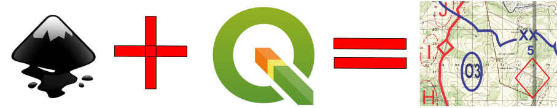
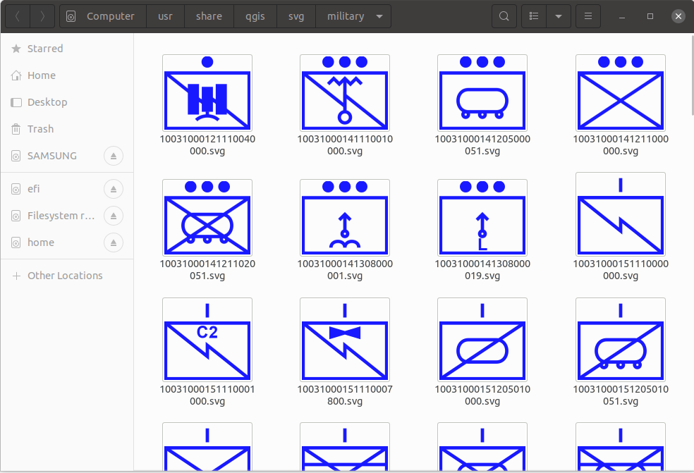

*Lang: pt-br*
# **Planejamento em Cartas Militares Digital**

### Considerações Iniciais:
- O tutorial tem o objetivo de difundir conhecimentos sobre planejamento tático para operações militares;
- A necessidade do tutorial foi identificada através da realização do Curso de Aperfeiçoamento de Oficiais na [Escola de Aperfeiçoamento de Oficiais](http://www.esao.eb.mil.br/) (EsAO) no ano de 2022. Existia uma demanda pela realização de estudos táticos de maneira digital e produção de produtos do estudo na forma de artefatos digitais (cartas militares de alta resolução, imagens vetorizadas, imagens rasterizadas, desenho de calcos de operações, etc);
- Para execução do planejamento tático em carta digital, foram adotados os softwares **QGIS** e **Inkscape**, ambos softwares de código aberto e de credibilidade alta na comunidade;
- Futuramente as idéias aqui contidas podem fomentar o desenvolvimento de uma solução integrada optimizada para atender os requisitos de uso do planejador tático militar.

> **[Inkscape](https://inkscape.org/)**: Editor de imagens vetorizadas.  

> **[QGIS](https://www.qgis.org/en/site/)**: É um software sistema de aplicação para informações geográficas que suporta visualização, edição e análise geospacial de dados.  
  
---

### **INSTRUÇÕES**

#### PASSO 1: Download e instalação dos softwares
[]() 
##### **Inkscape - Instalação:**
- Windows:
    - Realize o [download](https://inkscape.org/release/1.1.2/windows/64-bit/) do binário e instale seguindo as instruções da interface gráfica. 
- MacOS:
    - Realize o [download](https://inkscape.org/gallery/item/31681/Inkscape-1.1.2.dmg) e arraste o instalador para a pasta de aplicativos.
- GNU/Linux (Debian/ Ubuntu):
    - Encontra-se nos repositórios e também na forma de pacote [Snap](https://snapcraft.io/inkscape) e [Appimage](https://inkscape.org/release/all/gnulinux/appimage/).
```bash
sudo apt update && sudo apt install inkscape -y
```
##### **QGIS - Instalação:**
- Windows:
    - Realize o [download](https://qgis.org/downloads/QGIS-OSGeo4W-3.22.4-1.msi) do binário e instale seguindo as instruções da interface gráfica. 
- MacOS:
    - Realize o [download](https://qgis.org/downloads/macos/qgis-macos-ltr.dmg) e arraste o instalador para a pasta de aplicativos.
- GNU/Linux (Debian/ Ubuntu):
```bash
sudo apt install gnupg software-properties-common -y
```
```bash
wget -qO - https://qgis.org/downloads/qgis-2021.gpg.key | sudo gpg --no-default-keyring --keyring gnupg-ring:/etc/apt/trusted.gpg.d/qgis-archive.gpg --import
```
```bash
sudo chmod a+r /etc/apt/trusted.gpg.d/qgis-archive.gpg
```
```bash
sudo add-apt-repository "deb https://qgis.org/ubuntu $(lsb_release -c -s) main"
```
```bash
sudo apt update && sudo apt install qgis qgis-plugin-grass -y
```
> **Observações:** 
> - *Sempre dê preferência para a versão estável.*
> - *O QGIS encontra-se disponível para os Macbooks M1, arquitetura arm proprietária da Apple, apenas através da camada de compatibilidade e virtualização [Rosetta 2](https://support.apple.com/pt-br/HT211861). Sendo necessário instalar a mesma se for o caso.*
> - *No ubuntu 20.04 e posteriores, uma versão estável do QGIS encontra-se no repositório. Não é trata-se da ultima versão do software, porém é funcional e não possui bugs. Para obte-la, basta realizar a instalação a partir do gerenciador de pacotes nativo.*

---

#### PASSO 2: Configuração para obtenção de cartas online
- O [BDGEx](https://bdgex.eb.mil.br/bdgexapp) disponibiliza dezenas de camadas de cartas topográficas através de WMS/WMTS; 
- Através de uma conexão é possível consumir diversas cartas GIS topográficas, matriciais e vetorizadas em diferentes escalas.
- Para configurar o QGIS no seu computador e manipular suas cartas, vá no menu superior `Layer`, `Add Layer`, `Add WMS/WMTS layer`, no menu lateral à esquerda selecione `WMS/WMTS`, clique em `New` e insira os dados:

**Name:** | `EB BDGEx`
--------- | -----------
**URL:** | `http://bdgex.eb.mil.br/mapcache`

[]() 

> No Banco de Cartas do BDGEx, a carta mais usual para planejamentos militares é a **ctm50**, que faz referência a Carta Topográfica Matricial de escala 1:50000.

---

#### PASSO 3: Salvar uma carta em formato de imagem
- Caso necessite uma imagem de sua carta para editar e/ou inserir em uma apresentação de slides, vá em `Project`, `Import/Export`, `Export Map to Image`, atente para quantidade de DPI, a qualidade da carta e o tamanho do arquivo a ser criado estão diretamente relacionados a ela;
- Posteriormente, você também pode carregar a imagem que salvou no QGIS, para trabalhar apenas com ela. Isso pode ser especialmente útil em caso de não possuir uma conexão com a Internet e/ou cache do seu QGIS estiver vazio, como ocorre em novas instalações do software.

[]() 

> **Observação:** *É possível utilizar suas credenciais do [Banco de Dados Geográficos do Exército](https://bdgex.eb.mil.br/bdgexapp) para obter as cartas, porém isso não é obrigatório.*

---

#### PASSO 4: Importar uma carta de interesse
- Vá até o menu superior `Project`, `Layout Manager`, `Create Layout`, use modelo vazio, e atribua o nome que quiser;
- No menu superior selecione `Add Item` e em seguida `Add Map`, arraste para definir o tamanho do mapa, e aguarde alguns segundos para o QGIS carregue ele;
- A carta está orientada e rasterizada, com o movimento do cursor do mouse, no menu inferior você pode observar a todo instante as coordenadas geográficas;
- A quantidade de DPI fornece maior resolução e possibilidade de zoom com maior aproximação, porém exige mais recursos computacionais;
- Você pode adiocionar  elementos visuais complementares, como a seta de direção norte, e a escala da carta.

[]() 

---

#### PASSO 5: Desenhar um planejamento tático militar
- Vamos adotar a tabela a seguir como referência para desenhar as representações da operação tática militar;
- [Simbolos e convenções militares](https://github.com/postcristiano/simbolos-militares) deverão ser imagens vetorizados (`*.png` ou `*.svg`), você pode adicionar à carta arrastando de um diretório do seu computador;
- Na tabela abaixo está uma sugestão de emprego dos recursos do QGIS com equivalência para os simbolos e convenções militares;
- Para inserir um simbolo específico a partir do QGIS, vá em `Add item`, `Add Picture`, no menu que se abrirá a direita, acesse `Item Properties` e selecione sua figura.

Item no QGIS | Representação Militar
-------------- | -------------------------
Map |  Carta Topográfica
Picture | Calungas, Áreas de tropa e demais simbolos e convenções militares
Label | Legendas e nomenclaturas em calungas
Scale Bar | Escala
Shape |  Áreas de restrição de movimento, Corredores de Mobilidade
Arrow | Vias de Acesso
Node Item - polilyne | Simbologias do SCA, Corredores de mobilidade, Vias de acesso etc
Node Item - poligon | Áreas impedidas e restritas, áreas especiais, etc
North Arrow |  Orientar a carta

[]() 

> **SUGESTÃO** 
> - *Para ter os simbolos militares integrados ao seu QGIS, entre no diretório `../qgis/svg` da instalação do QGIS no seu computador, crie um diretório, por exemplo `military` e coloque o seu [inventário de simbolos militares](https://github.com/postcristiano/simbolos-militares);*
> - *Você mesmo pode desenvolver o seu inventários de simbolos reutilizáveis com o editor de imagens vetorizadas Inkscape;*
> - *A pasta é a mesma em todos sistemas operacionais, mudando apenas a hierarquia superior do diretório de acordo com o local de instalação e a organização de diretórios do seu sistema operacional;*
> - *Isso não é uma tarefa impositiva, você também pode simplesmente arrastar o simbolo vetorizado direto para a carta, posiciona-lo e ajustar o seu tamanho de acordo com a necessidade.*

[](https://github.com/postcristiano/simbolos-militares) 

---

#### Passo 6: Obter a carta topográfica com o planejamento tático
- Lembrando que foi montado um exemplo de manobra apenas para ilustrar, não existindo compromisso com fundamentos táticos e nem com a Doutrina Militar Terrestre;
- Vá dentro de Layout que você mountou sua manobra, clique em `Layout` e em `Export as a Image` ou `Export as a SVG`  ou  `Export as a PDF`;
- A qualidade da resolução é determinada pela quantidade de DPI que é diretamente proporcional ao tamanho do arquivo exportado.

[]() 

---

#### Passo 7: Obter o calco da manobra digital
- Em Itens no menu à direita, desmarque a camada relativa a carta, o que resta é a sua manobra, você pode selecionar os itens que lhe interessam para produzir calcos temáticos (movimento e manobra, restrição de movimento, inteligência, sistema de comunicações de área, entre outros)
- Igual ao passo anterior, vá dentro de Layout que você mountou sua manobra, clique em `Layout` e em `Export as a Image` ou `Export as a SVG`  ou  `Export as a PDF`;
- Não se esqueça de marcar pelo menos duas cruzetas de amarraçao de coordenadas, senão o seu calco será inutil.

[]() 

---

#### PASSO 8: Salvar planejamento tático em andamento
- Salvar o projeto do QGIS, é muito simples, você vai gerar um arquivo de extensão `*.qgz`;
- O arquivo gerado vai conter as configurações do servidor de mapas, cache do mapa e demais informações vetoriais de cada estilo que você desenvolveu.

[]() 

---

#### PASSO 9: Desenhar um Calco como camada do Inkscape 
- De posse de uma carta no formato de imagem podemos representar o planejamento de uma operação tática através de calcos temáticos;
- Abra o Inkscape, adicione a imagem da carta ao documento, crie outras camadas e faça as suas representações de planejamento;
- Com o recursos de camadas você pode desenhar calcos de movimento e manobra, sistema de comunicações de área, posição defensiva, dentre muitos outros;
- Por fim, selecione as camadas de interesse para exportar em um novo arquivo de imagem; 
- Você poderar criar uma nova imagem da carta apenas com as informações táde interesse.

[]() 

---

#### PASSO 10: Colagem de folhas de Calco impressas (Adicional)
- Esta atividade é uma sugestão para alguma situação de contigência. A idéia é não fazer essa tarefa, já que o objetivo principal é confeccionar todos os artefatos de planejamento da operação de maneira digital, seja por camadas vetorizadas no QGIS ou por imagens simples vetorizadas;
- O procedimento pode ser realizado em qualquer editor de imagem vetorial, utilizamos o Inkscape por ser um software de livre de grande qualidade e de código aberto;
- Inicialmente capture fotos de boa qualidade de todas as folhas de calco a serem coladas, aplicativos de scanner para smartphone podem auxiliar nesta tarefa;
- Crie um número de camadas igual ao número de folhas de calcos, mova cada folha em ordem, para a respectiva camada;
- Aplique transparência nas camadas;
- Realize o alinhamento das "cruzetas" de latitude e longitude;
- Remova a transparência e exporte o calco colado.
- A partir de agora, se tiver interesse, com a imagem vetorizada você pode preparar ela para adicionar como uma nova camada do QGIS, sobre a carta do Teatro de Operações.

[]() 

---

#### PASSO 11: Aplicação do calco na carta (Adicional)
- Assim como o  passo anterior, esta atividade é uma sugestão para alguma situação de contigência. A idéia é não fazer esta tarefa, já que o objetivo principal é confeccionar todos os artefatos de planejamento da operação de maneira digital, seja por camadas vetorizadas no QGIS ou por imagens simples vetorizadas;
- Aumente o contraste da imagem do calco colado de forma que as cores dos papéis que foram "scaneados" fiquem brancas;
- Aplique um pouco de transparência;
- Copie a imagem do calco e arraste para o QGIS, faça a amarração do calco com a carta;
- O calco será uma camada, e com ela você poderá dar continuidade no planejamento tático adicionando outros elementos;
- Vale ressaltar que você deverá realizar a [conversão de coordenadas UTM para geográficas](http://www.carto.eng.uerj.br/cgi/index.cgi?x=utm2geo.htm), para amarrar o calco corretamente em sua carta.

[]() 

---

### **REFERÊNCIAS**
- [Documentação QGIS](https://docs.qgis.org/3.16/pt_BR/docs/user_manual/)
- [Documentação Inkscape](https://inkscape.org/learn/tutorials/)
- [EB20-MF-10.102 - Manual de Fundamentos Doutrina Militar Terrestre](https://bdex.eb.mil.br/jspui/bitstream/123456789/4760/1/EB20-MF-10.102.pdf)
- [MD33-C-01 - Catálogo de Símbolos e Convenções Cartográficas das Forças](https://www.gov.br/defesa/pt-br/arquivos/File/legislacao/emcfa/publicacoes/md_33_c_01_catalogo_de_simbolos_e_convencoes_fa_1_d_2021.pdf)
- [Repositório de simbolos militares](https://github.com/postcristiano/simbolos-militares)

---

Author: *Cristiano Monteiro*  
2022 March 6 - version 0.8