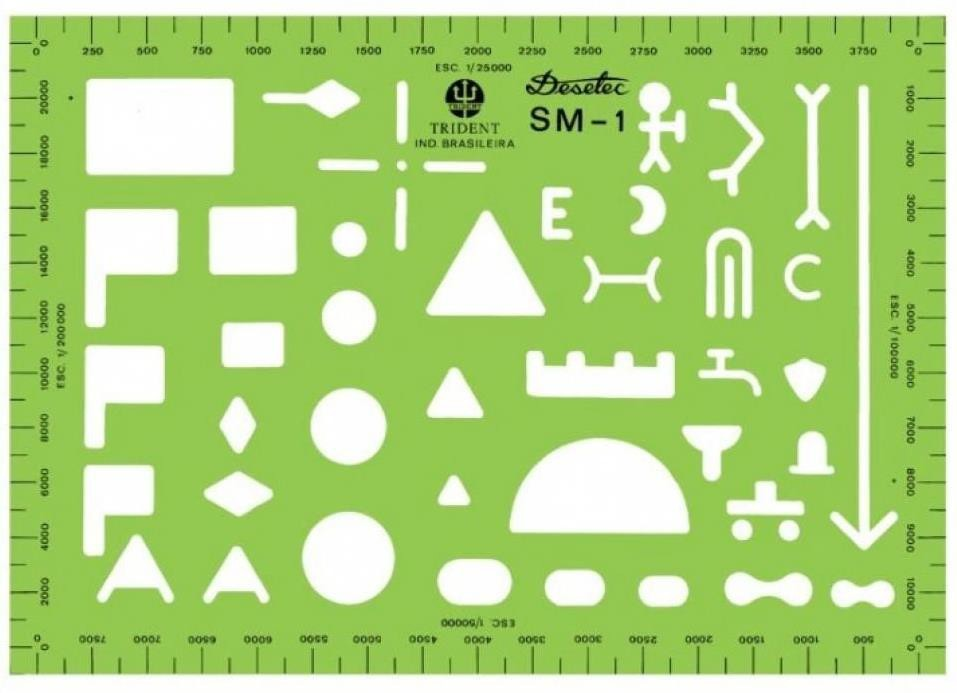
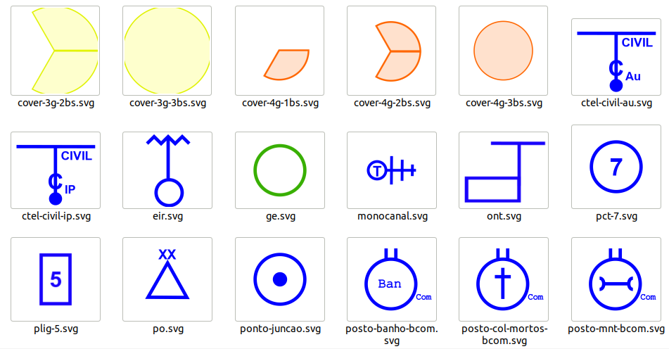

*Lang: pt-br*
# **Sistema de Comunicações de Área (SCA): Representação e planejamento em Cartas Militares Digitais**

### Considerações Iniciais:
- A principal finalidade deste trabalho é facilitar o entendimento do Sistema de Comunicações de Área; e    

- Propor uma referência para o desenvolvimento futuro de um software auxiliar de Planejamento do SCA com os seguintes requisitos: cadastrar os meios de comunicações disponíveis e limitados (problemas parciais que inviabilizam uso de determinadas funcionalidades) para os escalões do CGE, B Com, Cia Com; mapear as capacidades técnicas dos meios de comunicações de dotação; integrar-se com sistema de topografia (e.g. QGIS, OpenStreetMaps, BDGEx); integrar informações de fontes abertas sobre características técnicas de comunicações (potência de RF dos equipamentos, predição de enlace no ambiente de propagação de RF, altímetria do relevo e etc); e permitir a completa representação visual do planejamento tático de comunicações.  

### Sistema de Comunicações de Área
Trata-se da abstração técnica em prol de considerações táticas para representar de maneira ágil um sistema de comunicações complexo que envolve diversas tecnologias, com foco em segurança da informação, alta taxa de transmissão de dados, resiliência, flexibilidade, modularidade e demais princípios de emprego das comunicações militares. O SCA tem o objetivo de prover o máximo de consciência situacional empregando diversos recursos comunicações para unidades desdobradas no valor Divisão de Exército e superiores (entendimento do autor).  

---

### **ELEMENTOS/ENTIDADES DO SCA**

SIGLA | SIGNIFICADO | DESCRIÇÃO | ILUSTRAÇÃO
------ | --------------- | --------------- | ---------------
**CN** | Centro Nodal | Módulo que agrega diversos meios de comunicações. |
**NA** | Nó de Acesso | Módulo que agrega diversos meios de comunicações com a principal função de integrar uma Grande Unidade ao SCA.|
**Rpt** | Repetidora | Módulo que agrega diversos meios de comunicações, seu objetivo é regenerar o sinal e extender o alcance do enlace rádio. |
**SAM** | Sistema de Acesso Móvel | Subsistema do SCA, composto pelo equipamentos TAR e TAM. Concepção celular de cobertura de sinal e ligação ponto à ponto para consolidação do *backhaul* até o SG.
**TAR (ERB)** | (Estação Rádio Base)| Módulo tático dotado de uma Estação Rádio Base.
**TAM** | Terminal de Acesso Móvel | Dispositivo utilizado pelo usuário final. É a interface que possibilita o consumo de informações de sistemas de comando e controle e comunicação em redes TCP/IP. Ex: smartphones, tablets, laptops robustecidos. |  
**EIR** | Equipamento de Integração à Rede | Trata-se de um equipamento rádio que desempenha à função de ligação de apoio para se integrar ao SCA
**SG** | Sistemas Gerenciadores | Módulo que hospeda sistemas software de Comando e Controle e sistemas de gerenciamento técnico dos elementos do SCA. Possui diversos recursos para se manter o mais resiliente possível (backups, fonte de energia redundante, segurança física, SIEM e etc).
**C Tel** | Central Telefônica | | 
**ONT** | Optical Network Terminal | | 
**OLT** | Optical Line Terminal | | 
**Splitter** | N/A | Dispositivo para realizar divisão d| 
**Cb Ot** | Cabo Óptico |
**Fb Ot** | Fibra Óptica | |
**Cb Rede** | Cabo estruturado para rede | Ex: Cabo Cat 5E, cabo Cat 6A, etc.  | 
**C5P** | Cabo Múltiplo de 5 pares | 
**FDT** | Fio Duplo Telefônico | Fio metálico simples de emprego para telefonia analógica.

> **Backhauk do SAM:**   
> **Cobertura do SAM:**   

---

### **Planejamento do SCA**

- No processo de representação manual, se utiliza o normógrafo para representar a simbologia dos elementos do SCA;  

- As formas 1, 2, 3, 4, 5 e 6, são utilizadas para representação manual, conforme padronizado; 
- Este guia de planejamento emprega simbologia através de imagens vetorias, você pode criar suas próprias imagens através de um editor de imagens vetoriais como o [Inkscape](https://inkscape.org/) e armazena-las em um [repositório](https://github.com/postcristiano/simbolos-militares/blob/main/sca.md).

 

> **Enlace de Junção (Enlc Jç):** ligação entre NA - CN ou NA - NA.
> **Enlace de Rede (Enlc Rede):** ligação entre CN - CN. 

### **INSTRUÇÕES PARA O PLANEJAMENTO**
#### 1. Locação dos Nós de Acesso (NA)
- devem ser locados até 1.5 Km do centro do PC que deve apoiar, desde que dentro da Z Aç do escalão considerado;
- o centro do PC é a base do "mastro" do símbolo;
- No caso de ser uma Zona de Reunião (Z Reu), o NA é locado a 1.5 Km da borda ou canto inferior esquerdo do símbolo, se o PC estiver posicionado no centro da Z Reu, prevalece a regra anterior.

> **Prioridade de distribuição dos NA do B Com:**  
> 1. C Com do Cmdo do PCP da DE,  
> 2. C Com Cmdo do PC Altn da DE, se distinto da Art/DE,  
> 3. C Com Cmdo da AD,  
> 4. C Com Cmdo Gpt E,  
> 5. C Com Cmdo Gpt Log, quando ativado,  
> 6. C Com dos PC Altn da AD e Gpt E,  
> 7. C Com Cmdo de U diretamente subordinada, em caso de excepcionalidade,  
> 7.1 O PC Altn é sempre estabelecido com os mesmos meios que o PCP,  
> 7.1 Os NA distribuídos conseguem apoiar em comunicações todos os Elm justapostos.

#### 2. Determinação da quantidade e locação dos CN
- A quantidade de CN desdobrados deve permitir que todos os enlaces sejam estabelecidos;
- No planejamento inicial a rede deve conter  no **mínimo 04 CN** desdobrados e 02 CN em reserva;
- Ao quantificar a necessidade de meios de Com para o estabelecimento do SCA, considerar a necessidade de se ligar a um **CN futuro**, permitindo a malha se deslocar (nesse caso reservar 02 M Cn Rad);
- Os CN devem ser locados na z aç da DE, respeitando imposições táticas, técnicas e as regras básicas para locação de cabine.

#### 3. Estabelecimento da Malha Nodal
- Os CN desdobrados comunicam-se entre si e com os NA do PCP e PC Altn/DE;
- Os NA do PCP e PC Altn/DE estabelecem enlaces de junção com 02 CN distintos, observa-se que nunca o mesmo NA poderá lincar os seus 02 M Cn Rad, com outrso 02 M Cn Rad do mesmo CN;
- Mesmo com a supressão de algum CN da malha, os enlaces de confiabilidade criam, ao menos, 02 rotas físicas totalmente distintas de cada CCom restante da malha nodal;
- A malha nodal pode esgotar a possibilidade de enlaces disponíveis, após realizada a tarefa de estabelecer a conectividade dos NA, criando enlaces de confiabilidade redundante;
- No SCA divisionário, as ligações laterais e as ligações com o escalão superior somente são realizadas empregando enlaces de rede.

#### 4. Estabelecer a conectividade dos NA
- É a ligação dos NA do escalão subordinado com os servidores hospedados no SG.
- Estabelecer a rede para que as ligações entre os escalões subordinados e os SG se dêem com o menor número de saltos, prioritariamente, ofereçam a mesma capacidade deenlace;
- Os NA do PCP e PC Altn dos elementos subordinados estabelecem, ao menos, um enlace de junção com CN distintos.

#### 5. Estabelecimento das ligações de apoio aos PC sem NA
- São ligações de apoio aos CCom Cmdo: EIR e ligações físicas;
- Recebem ligações de apoio (emprego do EIR) as U/SU orgânicas da Bda Div ou diretamente ou diretamente subordinada à DE
- U/SU justapostas também compartilham as ligações de apoio;
- As ligações de apoio ao mesmo Cmdo devem ter origens distintas;
- Cada ligação de apoio do EIR utiliza uma porta LAN de usuário;
- Os postos rádio do EIR, bem como C Tel ou ONT, podem distar até 1 Km do centro do PC da U/SU (tendo como referência a base do símbolo);
- Necessidade mínima para estabelecer ligações de apop física:

Fração | Qtd pares de Fb Ot | C5P ou FDT
------ | ------------------ | ------------
U/SU Subrd DE | O1 | N/A
OM AD | 01 | N/A
OM Gpt E | 01 | N/A
PO | 01 | 01 (apenas audio)

> Apesar do SAM poder representar técnicamente uma ligação de apoio, será considerado apenas como **ligação de apoio ao movimento**. O Emprego do SAM para prover a ligação de apoio a um PC enseja riscos à segurança do Sistema, portanto deve ser evitada.

#### 6. Apropriação de Recursos Locais (Rcs Loc) de Comunicações
- Ocorre mediante autorização do escalão superior, levando em consideração o aspecto segurança.
- As centrais telefônicas automáticas civis, podem ser apropriadas com no mínimo a conectividade prevista na tabela a seguir:

Tipo | Descrição | Qtd pares de fibra | Cabo múltiplo de 5 pares de metal
-------| ---------| ---------|------------
C Tel Au Civ | Central telefônica comum | 01 | 01 (somente audio)
C Tel Au IP Civ | Entendido como qualquer ponto de presença, ou PoP, local onde o ISP (Internet Service Provider) mantém o Eqp de telecomunicações necessário para permitir o acesso local dos seus clientes à Internet. | 01 | Não se aplica

- Com a apropriação de rede de dados com acesso à Internet é possível emprego de um Virtual Private Network (VPN) para se obter rota para ROD (Rede Operacional de Defesa). Cabe ao gerenciador da ROD estabelecer as prerrogativas da maneira desta VPN.
- O PC da FTC acessa a ROD, uma vez que é responsabilidade do TO ligar-se ao PC da FTC.

#### 7. Estabelecer o Sistema de Assinante Móvel (SAM)
- as cabines TAR devem ser alocadas conforme as regras gerais de acessibilidade e dentro da Z Aç do escalão considerado;
- a partir do centro do símbolo do TAR será mensurada a cobertura radial das células (3G/4G/5G), conforme dados médios de desempenho desses meios.
- Considerando que os equipamentos possuem um total de 03 Base Stations (BS) com cobertura de 120 graus cada, não necessariamente todas as BS estarão ativadas simultâneamente, então podem ser representadas apenas 1 ou 2 setores.

---

### **Guerra Eletrônica**

---

### **Exemplos de planejamentos do SCA**

- [Planejamento do Sistema de Comunicações de Área em apoio a uma Operação Ofensiva de Aproveitamento do Êxito e Junção](https://shorturl.at/ghlIS)
- [Planejamento do Sistema de Comunicações de Área em apoio a uma Operação Ofensiva com atualização da capacidade de enlaces dos Centros Nodais](https://shorturl.at/gmoIS)

#### Tasks Todo:
- do english version
- put here tasks and gifs about step by step
- show how translate vetorized map to google, add to plj-mil tat
- show SCA systems like a SCA concept (1 bcom. 9 bcomge)
- explain about Libre OfficeDraw, Inkscape useful features

---

---

### **REFERÊNCIAS:**
- [Normas Gerais de Ação para o Emprego das Comunicações - CCom/EsAO - 2022](https:shorturl.at/eCGJU)
- [EB70-MC-10.246 - Manual de Campanha: As Comunicações nas Operações - 2020](https://bdex.eb.mil.br/jspui/bitstream/123456789/7073/1/EB70-MC-10.246_PDF.pdf)
- [EB70-MC-10.241 - Manual de Campanha: As Comunicações na Força Terrestre - 2018](https://bdex.eb.mil.br/jspui/bitstream/123456789/2651/5/EB70MC10241.pdf)

---

Author: *Cristiano Monteiro*  
2022 May 14 - version 0.1alfa