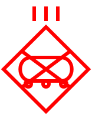
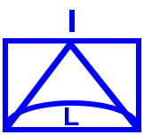
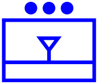

*Lang: pt-br*
# **Repositório de Símbolos e Convenções Militares para Operações Terrestres**

### **SOBRE**: 
- Este repositório é uma simples compilação de imagens vetoriais abstratas.
- O padrão de simbolos e convenções adotado neste repositório é o previsto pelas FFAA brasileiras, conforme o [MD33-C-01](https://www.gov.br/defesa/pt-br/arquivos/File/legislacao/emcfa/publicacoes/md_33_c_01_catalogo_de_simbolos_e_convencoes_fa_1_d_2021.pdf), baseado no padrão OTAN (NATO).
- Em desenvolvimento *rolling release*.

---

##### Referências para Ordenamento dos Símbolos
1. Do maior escalão para menor escalão;  
2. Da Infataria, Cavalaria, Artilharia, Engenharia, Comunicações até as Logisticas;  
3. Da menos especializada à mais especializada;  
4. Posições táticas no terreno.  

##### Simbologia do Valor das Unidades Militares Terrestres

VALOR | SIMBOLO
------------ | -------
Seção | **`••`**
Pelotão | **`•••`**
Companhia ou Esquadrão ou Bateria | **`\|`**
Batalhão ou Grupo | **`\|\|`**
Regimento | **`\|\|\|`**
Brigada ou Artilharia Divisioninária ou Grupamento ou Comando | **`X`**
Divisão de Exérciro | **`XX`**
Corpo de Exército | **`XXX`**
Comando Conjunto ou Teatro de Operações ou Comando da Zona de Defesa | **`XXXXXX`**

---

#### **SIMBOLOS DE UNIDADES TERRESTRES** - *"Calungas"*

DESCRIÇÃO | ABREVIATURA | SIMBOLO AMIGO | SIMBOLO INIMIGO
------------ | ------------ | ------------ | ------------ 
Teatro de Operações | TO|  |  
Comando da Zona de Defesa | ZD |  |  
Comando de Defesa Cibernética | Com D Ciber |  | 
Corpo de Exército | CE |  | 
Região Militar | RM |  | 
Divisão de Exército | DE |  | 
Artilharia de Corpo de Exército | AD/CE |  | 
Brigada de Infantaria | Bda Inf|  | 
Brigada de Infantaria Motorizada | Bda Inf Mtz|  | 
Brigada de Infantaria Leve | Bda Inf L |  | 
Brigada de Infantaria Paraquedista | Bda Inf Pqdt |  | 
Brigada de Infantaria de Selva | Bda Inf Sl|  | 
Brigada de Infantaria Blindada | Bda Inf Bld |  | 
Brigada de Infantaria Mecanizada | Bda Inf Mec |  | 
Brigada de Cavalaria Blindada | Bda C Bld |  | 
Brigada de Cavalaria Mecanizada | Bda C Mec |  | 
Artilharia Divisionária | AD |  | 
Brigada de Artilharia Antiaérea | Bda AAAe | 
Grupamento de Engenharia | Gpt E|  | 
Grupamento de Comunicações e Eletrônica | GCE |  | 
Grupamento Logístico | Gpt Log |  | 
Regimento de Infantaria Mecanizado | RI Mec | |  
Regimento de Carros de Combate | RCC |  |  
Regimento de Cavalaria Blindado | RCB |  |  
Regimento de Cavalaria Mecanizada | RC Mec|  |  
Força-Tarefa Aeromóvel Batalhão de Infantaria Leve | FT Amv BIL| 
Batalhão de Infantaria | BI | 
Batalhão de Infantaria Leve | BIL | 
Batalhão de Infantaria Paraquedista | BI Pqdt | 
Batalhão de Infantaria de Montanha | BI Mth | 
Batalhão de Infantaria Blindado | BI Bld | 
Batalhão de Infantaria Mecanizado | BI Mec| 
Grupo de Artilharia de Campanha | GAC | 
Grupo de Artilharia de Campanha Auto-rebocado 105mm | GAC AR 105mm | 
Grupo de Artilharia de Campanha Auto-rebocado 155mm | GAC AR 155mm | 
Grupo de Artilharia de Campanha Autopropulsado 155mm | GAC AP 155mm | 
Grupo de Artilharia de Campanha Autopropulsado Sobre Rodas 155mm | GAC AP SR 155mm | 
Grupo de Artilharia Antiaérea | GAAAe| 
Grupo de Lançadores Múltiplos de Foguetes | GLMF | 
Batalhão de Engenharia de Construção | BE Cnst | 
Batalhão de Engenharia de Combate | BE Cmb | 
Batalhão de Comunicações | B Com | 
Batalhão de Comunicações e Guerra Eletrônica | B Com GE | 
Batalhão de Guerra Eletrônica | BGE | 
Batalhão de Aviação do Exército | B Av Ex | 
Batalhão de Inteligência Militar | BIM | 
Batalhão de Saúde | B Sau | 
Força-Tarefa Companhia de Infantaria Mecanizada | FT Cia Inf Mec | | 
Companhia Comando | Cia C | 
Companhia de Infantaria | Cia Inf | 
Companhia de Polícia do Exército | Cia PE | 
Companhia de Infantaria Motorizada | Cia Inf Mtz | | 
Esquadrão de Reconhecimento | Esqd Rec | | 
Esquadrão de Cavalaria Mecanizado | Esqd C Mec |  | 
Bateria de Artilharia | Bia | 
Bateria Comando | Bia C | 
Bateria de Busca e Aquisição de Alvos | Bia BA | 
Bateria de Obuses | Bia O | 
Bateria de Artilharia Auto-rebocado 105mm | Bia AR 105mm | 
Bateria de Artilharia Antiaérea | Bia  AAAe | 
Bateria de Artilharia Antiaérea Leve | Bia AAAe L | 
Bateria de Lançadores Múltiplos de Foguetes | Bia LMF | 
Companhia de Engenharia de Combate Leve | Cia E Cmb L | 
Companhia de Engenharia Paraquedista | Cia E Pqdt | 
Companhia de Engenharia de Combate Mecanizada | Cia E Cmb Mec| 
Companhia de Engenharia de Construção | Cia E Cnst | 
Companhia de Engenharia de Pontes | Cia E Pnt | 
Companhia de Comunicações | Cia Com | 
Companhia de Comando e Controle | Cia C2 | 
Companhia de Guerra Eletrônica | Cia GE |  | 
Companhia de Guerra Cibernética | Cia G Ciber |  | 
Companhia Anticarro | Cia AC |  |
Esquadrão de Aviação do Exército | Esqd Av EX |  | 
Companhia de Assuntos Civis | Cia Ass Civ |  | 
Destacamento de Comunicação Social | Dstc Com Soc |  | 
Pelotão de Infantaria | Pel Inf | 
Pelotão de Infantaria Mecanizado | Pel Inf Mec| 
Pelotão de Cavalaria Mecanizado | Pel C Mec | 
Pelotão de Comunicações | Pel Com |
Pelotão Rádio | Pel Rad | 
Pelotão de Suprimento de Água | Pel Sup Água | 
Pelotão de Suprimento Classe I | Pel Sup Cl I | 
Pelotão de Suprimento Classe II | Pel Sup Cl II | 
Pelotão de Suprimento Classe III | Pel Sup Cl III | 
Pelotão de Manutenção e Transporte | Pel Mnt Transp | 
Grupo de Controle de Sistema | Gp Ctrl Sis | 
Turma Rádio-Satélite | Tu Rad Sat | 

---

### **SIMBOLOS DE POSTOS DE COMANDO (PC)**

#### Comando e Controle
SIGNIFICADO DA CONVENÇÃO | SIMBOLO 
------------ | ------------
Posto de Comando da Divisão de Exército |  |  
Posto de Comando da Brigada de Infantaria Mecanizada|  |  
Posto de Comando da Brigada de Cavalaria Blindada |  |  
Posto de Comando da Artilharia Divisionária|  |  
Posto de Comando do Grupamento de Engenharia |  |  

---

### **MONTE SEU PRÓPRIO SIMBOLO MILITAR**
Abaixo você tem duas opções de aplicações Web online para montar o seu simbolo militar e fazer download no formato de preferência.  
- [Portal de Simbologia Militar do Exército Brasileiro](https://simbologia.eb.mil.br/)
- [APP - 6D](https://spatialillusions.com/unitgenerator/)

---

### **REFERÊNCIAS:**
- [MD33-C-01 - Catálogo de Símbolos e Convenções Cartográficas das Forças Armadas](https://www.gov.br/defesa/pt-br/arquivos/File/legislacao/emcfa/publicacoes/md_33_c_01_catalogo_de_simbolos_e_convencoes_fa_1_d_2021.pdf)
- [MD33-M-02 - Manual de Abreviaturas, Siglas, Símbolos e Convenções Cartográficas das Forças Armadas](https://www.gov.br/defesa/pt-br/arquivos/File/legislacao/emcfa/publicacoes/manual-md33-m-02-manual-de-abreviaturas-siglas-simbolos-e-convencoes-cartograficas.pdf)

---

Author: *Cristiano Monteiro*  
2022 March 12 - version 0.5
