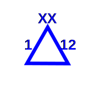

*Lang: pt-br*
# **Repositório de Símbolos e Convenções para o Planejamento Tático de Sistemas de Comunicações Militares**  

# *Sistema de Comunicações de Área (SCA)*

### Meios Físicos
Simbolo | Significado | Exemplo
------------ | ------------ | ------------
 | **Central telefônica automática civil** sendo apropriada. Deve ser escrito na sua parte superior o nome da localidade e abaixo o tipo de cabeamento utilizado. | 
 | **Central telefônica IP civil** sendo apropriada. Deve ser escrito na sua parte superior o nome da localidade e abaixo o tipo de cabeamento utilizado. |   
 | **Posto Telefônico** | 
 | **Virtual Private Network (VPN)**, utilizado em apropriação de ponto de acesso de dados civil. Ao centro do símbolo, valor da taxa de transmissão, e acima, o código do elemento que recebe esta apropriação como ligação de apoio. Se a VPN estiver complementando a conectividade de um posto já codificado, não é necessário o código. Ex.: VPN de 5 Mbps de velocidade da Bda "B" da DE. |  |
 | **Optical Network Terminal (ONT)**. Ex: ONT instalado no Posto de Observação 2 da DE afim de prover conectividade por meio físico ao SCA. |   

### **Meios Rádio**
Simbolo | Significado | Exemplo
------------ | ------------ | ------------
 | **Rádio Transceptor Monocanal** | N/A  
 | **Centro Nodal (CN)**, ao centro recebe o código do CN que representa. Os códigos para CN seguem o padrão: N1, N2, N3...N99. Para CN de outro escalão, utilizar a codificação prevista específica. |   
 | **Nó de Acesso (NA)**, ao centro recebe o código do NA da OM que representa. Os códigos para NA seguem o previsto nas tabelas de codificação. Ex: NA do CCom do BE Cmb servindo como PC Altn do Gpt E. |    
 | **Repetidores do SCA**, ao centro recebe o código da repetidora que representa. Os códigos para repetidoras seguem o previsto nas tabelas de codificação de acordo com o código específico que faz referência a repetidora. Ex: Rpt 2 do SCA do B Com. |    
 | **Terminal de Acesso Rádio (TAR)**, Trata-se de uma Estação Rádio Base (ERB.) Ao centro recebe o código do TAR que representa. Os códigos para TAR seguem o padrão: T1, T2, T3...T99. |    
 | **Terminal de Comunicações por Satélite Transportável** | N/A    
 | **Terminal de Comunicações por Satélite Leve** | N/A  
 | **Terminal de Comunicações por Satélite Rebocado** | N/A    
 | **Meio Satelital Civil**. O Código deve ser o da OM caso seja esse o único meio de comunicações disponível ao comando dela. Ex: Meio Satelital Civil como único meio da Bda "A". |   
 | **Equipamento de Interface de Rede (EIR)**, é uma estação rádio transceptora. Representa o CCom apoiado por EIR. Ao centro recebe o código de EIR da OM que representa. Os códigos seguem o previsto nas tabelas de codificação. Ex: A Su de AAAe da DE recebendo ligação de apoio. | 
 | **Estação Repetidora**, o tipo de equipamento deve ser indicado sob o símbolo. Ex: Site Tetra ou Master Site Tetra. Não confundir com a cabine Rpt do SCA. | 

### **Cobertura do Sistema de Assinantes Móvel (SAM)**

Tecnologia | 01 Base Station habilitada | Todas Base Stations habilitadas
------------ | ------------ | ------------  
**3G** |  |  |
**4G** |  |  |

> Identifique a equivalência do tamanho da quadrícula de sua carta através da escala topográfica. Utilize os dados médio de planejamento da tabela a seguir. Atente-se para os casos em que o tema tático atualize as medidas de performance de enlaces dos equipamentos. 

 \- | 4G | 4G | 3G | 3G | - | 
--- | --- | --- | --- | --- | --- | 
Tipo SAM | RURAL | URBANO | RURAL | URBANO | Densidade |  | p
Portátil | 6 Km | 4 Km | 10 Km | 8 Km | Baixa | 
Veicular | 7 Km | 5 Km | 11 Km | 9 Km | Baixa | 
Fixo | 8 Km | 5.5 Km | 12 Km | 9.5 Km | Baixa | 
Portátil | 5.5 Km | 2 Km | 8.5 Km | 6 Km | Superior | 
Veicular | 6 Km | 3.5 Km | 10 Km | 7.5 Km | Superior | 
Fixo | 6.5 Km | 4.5 Km |11.5 Km | 8.5 Km | Superior |  

> Para determinar o tamanho da cobertura de sinal (veicular, portátil, de baixa densidade, de alta densidade, etc), do seu TAR, adeque o tamanho do raio do desenho de representação de cobertura conforme a equivalência das medidas para a sua carta. Na necessidade de emprego de 02 Base Stations habilitadas, utilize dois desenhos de 01 Base Station.  

### **Meios de Guerra Eletrônica**
Simbolo | Significado | Exemplo
------------ | ------------ | ------------
 | **COGE**, ao centro recebe os códigos que são determinados por documentação específica. |    
 | **COGE Avçd**, ao centro recebe os códigos que são determinados por documentação específica. |      
 | **Cabine de Guerra Eletrônica**, pode ser MAE/MAGE e dos tipos Com/NCom. Ao centro recebe os códigos que são determinados por documentação específica. Usualmente os meios MAE/MAGE Com utilizam números ímpares como códigos. | 
 | **Cabine de Guerra Eletrônica**, pode ser MAE/MAGE e dos tipos Com/NCom. Ao centro recebe os códigos que são determinados por documentação específica. Usualmente os meios MAE/MAGE NCom utilizam números pares como códigos. |  

### **Logística**
Simbolo | Significado | Exemplo
------------ | ------------ | ------------
 | **AT do B Com** |  
 | **Posto de Socorro do B Com** |  
 | **Posto de Coleta de Mortos do B Com** |  
 | **Posto de Banho do B Com** |  
 | **Posto de Manutenção do B Com** |  

### **Diversos**
Simbolo | Significado | Exemplo
------------ | ------------ | ------------
 | **Aérodromo Civil ou Civil/Militar** | N/A  
 | **Área de Pouso de Helicóptero** | N/A 
 | **Ponto de Controle número 7**, o simbolo possui ao centro o número a que faz referência. |  N/A
 | **Ponto de Ligação número 5**, o simbolo possui ao centro o número a que faz referência. | N/A
 | **Ponto de Junção** | N/A
 | **Posto de Observação da Divisão de Exército**, para o DSMC, representa-se o meio de comunicações empregado no terminal da Lig Ap ao PO. Ex: P Obs Nr 1 da 12ª DE |    

---

### Codificação nível Divisão de Exército (DE)

#### Elementos da Divisão de Exército

Cod | Elm | Cod | Elm | Cod | Elm | Cod | Elm | 
--- | --- | --- | --- | --- | --- | --- | --- | 
F0 | PCP/DE | F5 | U AAAe | FA | Elm Ass Civ | FG | PO Nr 2
F1 | PC Altn/DE | F6 | Su AAAe | FB | Elm DQBRN | FH | PO Nr 3
F2 | Gpt Log | F7 | Cia PE | FC | Elm Av Ex | FI | PO Nr 4
F3 | Gpt Log | F8 | Cia C/DE | FD | Elm Op Ap Info| FJ/FZ | Indic Res
F4 | RC Mec | F9 | Cia GE | FE | PO Nr 1 |

#### Elementos da Brigada "A" (diretamente subordinada à DE)

Cod | Elm | Cod | Elm | Cod | Elm | Cod | Elm | 
--- | --- | --- | --- | --- | --- | --- | --- | 
G0 | PCP/Bda | G2 | GAC | G4 | Rpt Bda | G6 à G9 | Indic Res
G1 | PC Altn/Bda | G3 | Elm E | G5 | Bia AAAe |

#### Elementos da Brigada "B" (diretamente subordinada à DE)

Cod | Elm | Cod | Elm | Cod | Elm | Cod | Elm | 
--- | --- | --- | --- | --- | --- | --- | --- | 
H0 | PCP/Bda | H2 | GAC | H4 | Rpt Bda | H6 à H9 | Indic Res
H1 | PC Altn/Bda | H3 | Elm E | H5 | Bia AAAe |

#### Elementos da Brigada "C" (diretamente subordinada à DE)

Cod | Elm | Cod | Elm | Cod | Elm | Cod | Elm | 
--- | --- | --- | --- | --- | --- | --- | --- | 
I0 | PCP/Bda | I2 | GAC | I4 | Rpt Bda | I6 à I9 | Indic Res
I1 | PC Altn/Bda | I3 | Elm E | I5 | Bia AAAe |

#### Elementos da Brigada "D" (diretamente subordinada à DE)

Cod | Elm | Cod | Elm | Cod | Elm | Cod | Elm | 
--- | --- | --- | --- | --- | --- | --- | --- | 
J0 | PCP/Bda | J2 | GAC | J4 | Rpt Bda | J6 à J9 | Indic Res
J1 | PC Altn/Bda | J3 | Elm E | J5 | Bia AAAe |

#### Elementos da Brigada "E" (diretamente subordinada à DE)

Cod | Elm | Cod | Elm | Cod | Elm | Cod | Elm | 
--- | --- | --- | --- | --- | --- | --- | --- | 
K0 | PCP/Bda | K2 | GAC | K4 | Rpt Bda | K6 à K9 | Indic Res
K1 | PC Altn/Bda | K3 | Elm E | K5 | Bia AAAe |

#### Elementos da Artilharia Divisionária

Cod | Elm | Cod | Elm | Cod | Elm |  
--- | --- | --- | --- | --- | --- |  
L0 | PC | L2 | Elm BA | LA à LG | GAC 55 AP | 
L1 | Elm MF | L3 à L9 | GAC 155 AR | LH à LZ | Indic Res |

#### Elementos da Engenharia Divisionária

Cod | Elm | Cod | Elm | Cod | Elm | Cod | Elm |  
--- | --- | --- | --- | --- | --- | --- | --- |
M0 | PC | L1 | Elm E Pnt | M2 à M5 | BE Cmb | M6 à M9 | BE Cnst
MA à MF | Elm Esp E | MG à MK | Indic Res |

#### Elementos do Batalhão de Comunicações

Cod | Elm | Cod | Elm | Cod | Elm | Cod | Elm | 
--- | --- | --- | --- | --- | --- | --- | --- | 
N0 | B Com | N6 | CN 6 | ND | Rpt 4 | T2 | TAR 2
N1 | CN 1 | F7 | CN 7 | NE | Rpt 5 | T3 | TAR 3
N2 | CN 2 | N8 | CN 8 | NF | Rpt 6 | T4 | TAR 4
N3 | CN 3 | NA | Rpt 1 | NG | Rpt 7| T5 | TAR 5
N4 | CN 4 | NB | Rpt 2 | NH | Rpt 8 | T6 | TAR 6
N5 | CN 5 | NC | Rpt 3 | T1 | TAR 1| NI à NZ | Indic Res

#### Elementos do Vizinho da Esquerda

Cod | Elm | Cod | Elm | Cod | Elm | Cod | Elm | 
--- | --- | --- | --- | --- | --- | --- | --- | 
O0 | PC/Cmdo | O1 | PC/ Altn | O2 | CN 1 | O3 | CN 2
O4 | CN 3 | 05 | Rpt 1 | 06 | Rpt 2 | 07 | Indic Res

#### Elementos do Vizinho da Direita

Cod | Elm | Cod | Elm | Cod | Elm | Cod | Elm | 
--- | --- | --- | --- | --- | --- | --- | --- | 
P0 | PC/Cmdo | P1 | PC/ Altn | P2 | CN 1 | P3 | CN 2
P4 | CN 3 | P5 | Rpt 1 | P6 | Rpt 2 | P7 | Indic Res

#### Elementos Apoiado

Cod | Elm | Cod | Elm | Cod | Elm | Cod | Elm | 
--- | --- | --- | --- | --- | --- | --- | --- | 
Q0 | PC/Cmdo | Q1 | PC/ Altn | Q2 | CN 1 | Q3 | CN 2
Q4 | CN 3 | Q5 | Rpt 1 | Q6 | Rpt 2 | Q7 | Indic Res

> Na omissão de um código específico, ao PC Altn acresce-se complementarmente o digito "A" ao código do PCP. Ex: PCP 2 RC Mec, código F4 e seu PC Altn, **F4A**

---

### Codificação nível Força Terrestre Componente (FTC)

#### Elementos da Força Terrestre Componente (FTC)

Cod | Elm | Cod | Elm | Cod | Elm | Cod | Elm | 
--- | --- | --- | --- | --- | --- | --- | --- | 
A0 | PCP/FTC | A6 | 2 RC Mec | AC | 1 B Av Ex | AI | Bda Op Esp
A1 | 1 BI Mtz | A7 | 3 RC Mec | AD | 2 B Av Ex | AJ | OM Ass Civ
A2 | 2 BI Mtz | A8 | 4 RC Mec | AE | 3 B Av Ex | AK | OM Op Ap Info
A3 | 3 BI Mtz | A9 | 1 RCC | AF | 4 B Av Ex | AL | Indic Res
A4 | 1 BPE | AA | 1 BDQBRN | AG | 5 B Av Ex | AM | Indic Res
A5 | 1 RC Mec | AB | 1 BIM | AH | Btl Mnt Sup Av Ex | AN | Indic Res

#### Elementos do Corpo Logístico da FTC

Cod | Elm | Cod | Elm | Cod | Elm | Cod | Elm | 
--- | --- | --- | --- | --- | --- | --- | --- | 
B0 | PC CL | B6 | 2 B Sup | BC | 4 B Mnt | BI | 2 B Sau
B1 | 11 Gpt Log | B7 | 3 B Sup | BD | 1 B Trnp | BJ | 3 B Sau
B2 | 12 Gpt Log | B8 | 4 B Sup | BE | 2 B Trnp | BK | 4 B Sau
B3 | 13 Gpt Log | B9 | 1 B Mnt | BF | 3 B Trnp | BL | Indic Res
B4 | 14 Gpt Log | BA | 2 B Mnt | BG | 4 B Trnp | BM | Indic Res
B5 | 1 B Sup | BB | 3 B Mnt | BH | 1 B Sau | BN | Indic Res

#### Elementos do Corpo de Artilharia da FTC

Cod | Elm | Cod | Elm | Cod | Elm | Cod | Elm | 
--- | --- | --- | --- | --- | --- | --- | --- | 
C0 | PC CA | C8 | 117 GAAAe | CG | 171 GAC 155 AR | CO | 11 GBA
C1 | PC Bda AAAe | C9 | 11 B Mnt Sup AAe | CH | 112 GAC 155 AP | CP | 12 GBA
C2 | 111 GAAAe | CA | 111  GAC 155 AR | CI | 122 GAC 155 AP | CQ | 1 GMF
C3 | 112 GAAAe | CB | 121  GAC 155 AR | CJ | 132 GAC 155 AP | CR | 2 GMF
C4 | 113 GAAAe | CC | 131 GAC 155 AR | CK | 142 GAC 155 AP | CS | Indic Res
C5 | 114 GAAAe | CD | 141 GAC 155 AR | CL | 152 GAC 155 AP | CT | Indic Res
C6 | 115 GAAAe | CE | 151 GAC 155 AR | CM | 162 GAC 155 AP | CU | Indic Res
C7 | 116 GAAAe | CF | 161 GAC 155 AR | CN | 172 GAC 155 AP | CV | Indic Res

#### Elementos do Corpo de Engenharia da FTC

Cod | Elm | Cod | Elm | Cod | Elm | Cod | Elm | 
--- | --- | --- | --- | --- | --- | --- | --- | 
D0 | PC CE | D4 | 141 BE Cmb | D8 | 142 BE Cmb | DH | 1 BE Pnt
D1 | 111 BE Cmb | D5 | 112 BE Cmb | D9 à DC | 1 BE Cmb ao 4 BE Cmb | DI à DP | Elm E Esp
D2 | 121 BE Cmb | D6 | 122 BE Cmb | DD à DG | 1 BE Cnst ao 4 BE Cnst | DQ à DZ | Indic Res
D3 | 131 BE Cmb | D7 | 132 BE Cmb |  |  |  | 

#### Elementos do CGE da FTC

Cod | Elm | Cod | Elm | Cod | Elm | Cod | Elm | 
--- | --- | --- | --- | --- | --- | --- | --- | 
E0 | PC CCom GE (SFC) | E7 | 13 B Com | EE | CN 2/1/1 B Com Nd | EL à ES | CN 1 à 8/2/1 B Com Nd
E1 | 1 B Cmdo e Ct | E8 | 14 B Com | EF | CN 3/1/1 B Com Nd | | 
E2 | 1 B Com Nd | E9 | 11 Cia GE | EG | CN 4/1/1 B Com Nd | ET à EAA | CN 1 à 8/3/1 B Com Nd
E3 | 1 B Com Intg | EA | 12 Cia GE | EH | CN 5/1/1 B Com Nd | | 
E4 | 1 BGE | EB | 13 Cia GE | EI | CN 6/1/1 B Com Nd | E10 à E17 | Rpt 1 B Com Nd
E5 | 11 B Com | EC | 14 Cia GE | EJ | CN 7/1/1 B Com Nd | E18 | Indic Res
E6 | 12 B Com | ED | CN 1/1/1 B Com Nd | EK | CN 8/1/1 B Com Nd | E19 | Indic Res

#### Elementos da Brigada da FTC

Cod | Elm | Cod | Elm | Cod | Elm | Cod | Elm | 
--- | --- | --- | --- | --- | --- | --- | --- | 
R0 | PCP Bda | R4 | U Cmb 3 | R8 | AAAe | RC | Elm Log
R1 | PC Altn Bda | R5 | U Cmb 4 | R9 | Cia/Esqd AC | RD | Elm E Esp
R2 | U Cmb 1 | R6 | SU Cmb | RA | Elm E | RE | Esqd/Cia Cmdo
R3 | U Cmb 2 | R7 | GAC | RB | Cia Com | RF à RN | Indic Res 

---

### **REFERÊNCIAS:**
- [Normas Gerais de Ação para o Emprego das Comunicações - CCom/EsAO - 2022](https:shorturl.at/eCGJU)
- [EB70-MC-10.246 - Manual de Campanha: As Comunicações nas Operações - 2020](https://bdex.eb.mil.br/jspui/bitstream/123456789/7073/1/EB70-MC-10.246_PDF.pdf)
- [EB70-MC-10.241 - Manual de Campanha: As Comunicações na Força Terrestre - 2018](https://bdex.eb.mil.br/jspui/bitstream/123456789/2651/5/EB70MC10241.pdf)

---

Author: *Cristiano Monteiro*  
2022 May 7 - version 0.1
